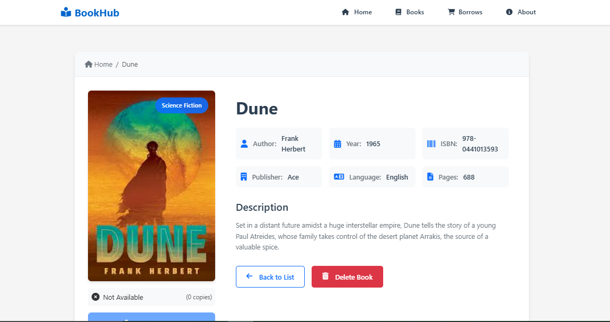

# BookHub - Library Management Application

A modern, responsive library management system built with Angular, featuring book borrowing, searching, and management capabilities.





## Technology Stack

### Frontend

- **Framework**: Angular 18.2.4
- **Architecture**: Standalone Components
- **State Management**: RxJS for reactive state handling
- **UI Components**: Custom-built components with modern design
- **Styling**: CSS with responsive design
- **Icons**: Font Awesome
- **Routing**: Angular Router with lazy loading

### Backend

- **API Server**: JSON Server
- **Database**: JSON file (db.json)
- **HTTP Client**: Angular HttpClient

## Features

### Book Management

- View all books in a responsive grid layout
- Search books by title or author
- Filter books by genre
- Sort books by year, title, or author
- View detailed information about each book
- Track book availability and copies

### Borrowing System

- Borrow books with automatic due date calculation (14 days)
- Track borrowed books status
- Prevent borrowing of unavailable books
- Real-time UI updates for book availability

### User Interface

- Modern, responsive design
- Grid layout with 5 books per row (responsive)
- Book cards with hover effects
- Loading states and error handling
- Clear user feedback for all actions
- Search and filter functionality
- Smooth animations and transitions

## Project Structure

```
src/
├── app/
│   ├── core/               # Core functionality
│   │   ├── models/         # Data models
│   │   └── services/       # Global services
│   ├── features/          # Feature modules
│   │   ├── book-details/   # Book details feature
│   │   ├── home/          # Home page with book list
│   │   └── book-management/# Book management feature
│   └── shared/            # Shared components
└── assets/               # Static assets
```

## Key Components

### Services

- **BookService**: Handles book-related operations
- **BorrowService**: Manages book borrowing functionality

### Components

- **BookListComponent**: Displays grid of books with filtering
- **BookDetailsComponent**: Shows detailed book information
- **HomeComponent**: Main landing page
- **BookManagementComponent**: Admin book management

## Header Implementation

The application features a modern, responsive header with the following characteristics:

### Design

- Fixed position header that stays at the top while scrolling
- Clean, modern design with subtle box shadow
- Responsive layout that adapts to different screen sizes
- Maximum width of 1200px with auto margins for larger screens
- Height of 60px for optimal visibility

### Navigation

- Logo section with book icon and app name
- Main navigation links with icons:
  - Home (house icon)
  - Books (book icon)
  - About (info circle icon)
- Active link highlighting
- Smooth hover transitions

### Styling Features

- Custom color scheme with #0066cc for the logo
- Subtle animations on hover
- Font Awesome icons for visual enhancement
- Consistent spacing with gap utilities
- Flexible layout using CSS Flexbox
- Mobile-responsive design

### Technical Implementation

- Standalone Angular component
- RouterModule integration for navigation
- RouterLinkActive for active route highlighting
- CSS custom properties for maintainable styling
- Icon integration with Font Awesome
- Modular SCSS structure

### Code Organization

- Component-based architecture
- Separation of concerns (HTML, CSS, TS)
- Clean, semantic HTML structure
- Maintainable CSS with BEM-like naming
- Type-safe TypeScript implementation

## Design Decisions

1. **Standalone Components**

   - Improved modularity and tree-shaking
   - Simplified dependency management

2. **Reactive Programming**

   - RxJS for state management
   - Improved error handling
   - Better async operation management

3. **Responsive Design**

   - Mobile-first approach
   - Flexible grid system
   - Breakpoints for different screen sizes

4. **Error Handling**
   - Comprehensive error messages
   - User-friendly error displays
   - Automatic retry mechanisms

## Setup and Installation

1. **Prerequisites**

   ```bash
   Node.js (Latest LTS version)
   npm (comes with Node.js)
   Angular CLI (v18.2.4)
   ```

2. **Installation**

   ```bash
   # Clone the repository
   git clone [repository-url]

   # Install dependencies
   npm install

   # Start JSON Server (in one terminal)
   json-server --watch db.json

   # Start Angular development server (in another terminal)
   ng serve
   ```

3. **Access the Application**
   - Frontend: http://localhost:4200
   - JSON Server: http://localhost:3000

## Development Commands

```bash
# Start development server
ng serve

# Build for production
ng build

# Run tests
ng test

# Generate new component
ng generate component component-name
```

## Future Enhancements

1. **Authentication & Authorization**

   - User authentication system
   - Role-based access control
   - User profiles

2. **Advanced Features**

   - Book return functionality
   - Late return penalties
   - Book reservations
   - Reading history

3. **Performance Optimizations**
   - Implement caching
   - Optimize image loading
   - Add pagination

## Contributing

1. Fork the repository
2. Create your feature branch
3. Commit your changes
4. Push to the branch
5. Create a new Pull Request

## Development server

Run `ng serve` for a dev server. Navigate to `http://localhost:4200/`. The application will automatically reload if you change any of the source files.

## Build

Run `ng build` to build the project. The build artifacts will be stored in the `dist/` directory.

## Further help

To get more help on the Angular CLI use `ng help` or go check out the [Angular CLI Overview and Command Reference](https://angular.dev/tools/cli) page.
